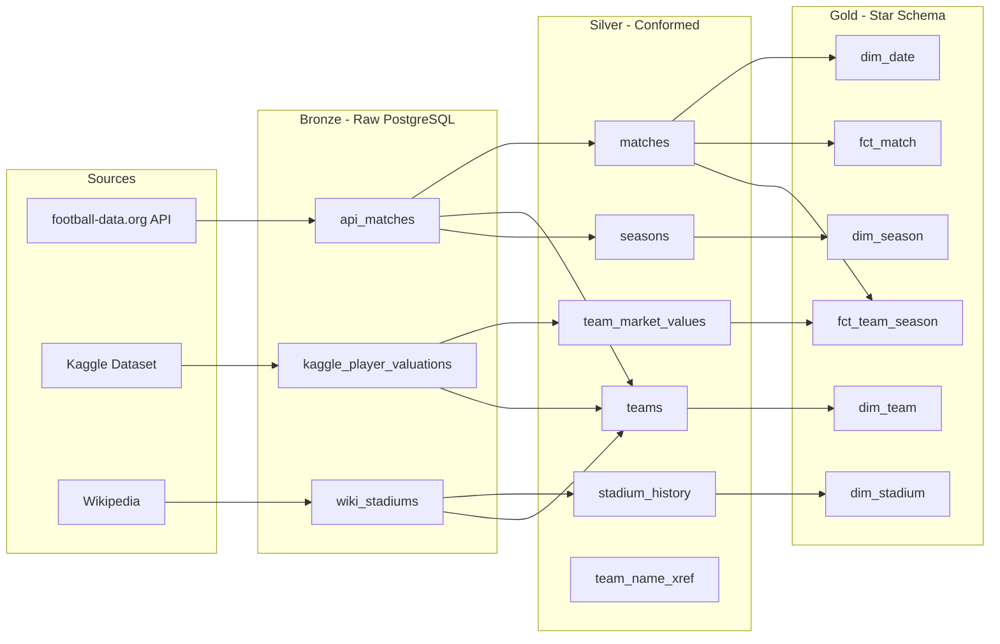
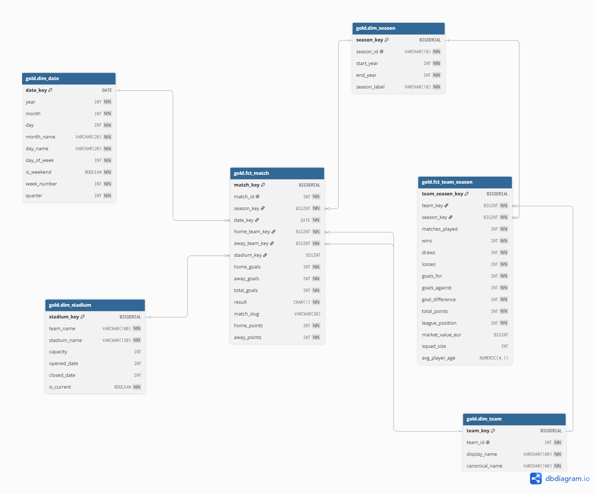

# Football Data Warehouse

An end-to-end data warehousing solution for English Premier League data built on the **Medallion Architecture** (Bronze → Silver → Gold). The pipeline extracts data from three external sources, transforms through normalized layers and produces a **Kimball star schema** ready for Power BI dashboards.

> **Disclaimer:** This project is for educational purposes only and is not intended for commercial use.

---

## Data Architecture



### Pipeline Flow

```
Extract (→ Bronze)  →  Quality Check  →  Silver  →  Quality Check  →  Gold  →  Quality Check
```

---

## Layer Details

### Bronze Layer (PostgreSQL)

Append-only raw storage. Each extractor fetches data from its source and writes directly into PostgreSQL. Data stored as-is with `run_id` (UUID) for lineage tracking. API match data preserved as raw JSONB payloads. No deduplication, no transformation.

### Silver Layer (PostgreSQL)

Deduplicated, normalized and linked entities:

- **Team normalization** - `fn_normalize_team_name()` unifies inconsistent naming across three sources (e.g. "Manchester City FC", "Manchester City", "Man City" → single canonical entry)
- **Cross-reference audit trail** - `team_name_xref` maps every raw source name to its canonical form with source system tracking
- **Stadium history** - tracks relocations with auto-close logic (when a newer stadium opens, older one gets `closed_date` set automatically)
- **Match slug** - human-readable identifiers (`2023-08-11_BUR_MCI`) using official TLA codes from the API
- **Idempotent upserts** - pipeline can run repeatedly without duplicates via `ON CONFLICT` clauses

### Silver Layer: Physical model


### Gold Layer (PostgreSQL - Star Schema)

Business-ready **Kimball star schema** with surrogate keys and explicit table loading. Dimensions are loaded first, facts reference them via surrogate keys.

#### Dimension Tables

| Table | Surrogate Key | Description |
|-------|--------------|-------------|
| `dim_team` | `team_key` | Team identity: display name, canonical name |
| `dim_season` | `season_key` | Season years with display label ("2023/24") |
| `dim_date` | `date_key` | Calendar table generated from match date range: year, month, day, day of week, weekend flag, quarter |
| `dim_stadium` | `stadium_key` | Stadium history per team with capacity, opened/closed years, `is_current` flag |

#### Fact Tables

| Table | Grain | Description |
|-------|-------|-------------|
| `fct_match` | One row per match | Teams, goals, result, match_slug, stadium reference, computed points |
| `fct_team_season` | One row per team per season | W/D/L, goals, points, league position, denormalized market value and squad data |

### Gold Layer: Physical model


---

## Data Sources

| Source | Data | Method |
|--------|------|--------|
| [football-data.org](https://www.football-data.org/) | Match results, scores, dates, team TLA codes | REST API (JSON) |
| [Transfermarkt Datasets (Kaggle)](https://www.kaggle.com/datasets/davidcariboo/player-scores) | Player market values, squad size, age | CSV download |
| [Wikipedia](https://en.wikipedia.org/wiki/List_of_Premier_League_stadiums) | Stadium names, capacity, opened/closed years | Web scraping |

---

## Data Quality

Automated SQL-based quality checks run after each pipeline stage. If any check fails, the pipeline halts immediately - bad data does not propagate downstream.

| Layer | Checks |
|-------|--------|
| **Bronze** | Tables not empty, no NULL payloads, no invalid entries |
| **Silver** | No duplicate match IDs, referential integrity (teams ↔ matches), 380 matches per completed season, no team with multiple active stadiums, market values within valid range, all source names resolved via xref, no NULL/duplicate/malformed match_slug |
| **Gold** | All dimensions populated, no duplicate surrogate keys, referential integrity (facts → dimensions), 20 teams per season, 38 matches per team in completed seasons, league positions 1–20, no team with multiple current stadiums |

---

## Quick Start

### Prerequisites

- **PostgreSQL** installed and running
- **Python 3.12+**
- API key from [football-data.org](https://www.football-data.org/)

> **Note:** To run SQL scripts from the terminal, `psql` must be in your PATH. On Windows, add your PostgreSQL `bin` folder (e.g. `C:\Program Files\PostgreSQL\18\bin`) - the version number in the path must match your installed version.

### Setup

**1. Clone the repository**

```bash
git clone https://github.com/dchytil/football_datawarehouse.git
cd football_datawarehouse
```

**2. Create virtual environment**

```bash
python -m venv venv

# Linux / Mac
source venv/bin/activate

# Windows (PowerShell)
venv\Scripts\activate
```

**3. Install dependencies**

```bash
pip install -r requirements.txt
```

**4. Create `.env` from template**

```bash
# Linux / Mac
cp .env.example .env

# Windows (PowerShell)
Copy-Item .env.example .env
```

Fill in the required values: `DB_USER`, `DB_PASS`, `FOOTBALL_API_KEY`, and update `TARGET_SEASONS` as needed.

**5. Download Kaggle dataset**

Download the [Football Data from Transfermarkt](https://www.kaggle.com/datasets/davidcariboo/player-scores) dataset and place these three files into `data/kaggle/`:

- `players.csv`
- `player_valuations.csv`
- `clubs.csv`

**6. Create the database and initialize tables**

```bash
psql -U DB_USER -c "CREATE DATABASE football_dw;"

psql -U DB_USER -d football_dw -f sql/00_init_schemas.sql
psql -U DB_USER -d football_dw -f sql/01_raw_tables.sql
psql -U DB_USER -d football_dw -f sql/02_silver_tables.sql
psql -U DB_USER -d football_dw -f sql/03_gold_tables.sql
```

Alternatively, you can run the SQL files from [pgAdmin](https://www.pgadmin.org/) or [DBeaver](https://dbeaver.io/).

**7. Run the pipeline**

```bash
python main.py
```

### Connect to the Database

```
Host:     localhost
Port:     5432
Database: football_dw
User:     (from .env)
Password: (from .env)
```

Use [pgAdmin](https://www.pgadmin.org/) or [DBeaver](https://dbeaver.io/) to explore the data.

---

## Tools & Technologies

| Technology | Purpose |
|-----------|---------|
| **PostgreSQL** | Data warehouse database |
| **Python 3.12** | ETL pipeline |
| **BeautifulSoup** | Web scraping (Wikipedia) |
| **Requests** | API calls (football-data.org) |
| **pandas** | CSV processing (Kaggle dataset) |

---

## Repository Structure

```
football-dw/
│
├── data/
│   └── kaggle/                                   # CSV files from Kaggle (not tracked in git)
│
├── docs/                                         # ER diagrams and screenshots
│   ├── silver_model.png
│   ├── gold_model.png
│
├── sql/                                          # Schema definitions
│   ├── 00_init_schemas.sql                       # raw/silver/gold schema creation
│   ├── 01_raw_tables.sql                         # Bronze layer tables
│   ├── 02_silver_tables.sql                      # Silver layer tables + functions
│   ├── 03_gold_tables.sql                        # Gold layer: star schema
│   └── deletion.sql                              # Teardown script
│
├── src/
│   ├── db.py                                     # Database connection manager
│   ├── extract/                                  # Source → Bronze (PostgreSQL)
│   │   ├── football_api.py                       # REST API extractor
│   │   ├── kaggle_loader.py                      # Kaggle dataset loader
│   │   └── wiki_scraper.py                       # Wikipedia scraper
│   ├── transform/                                # SQL-based transformations
│   │   ├── to_silver.py                          # Bronze → Silver
│   │   └── to_gold.py                            # Silver → Gold (star schema)
│   └── quality/                                  # Automated quality gates
│       ├── sql_quality/
│       │   ├── 01_bronze_check.sql
│       │   ├── 02_silver_check.sql
│       │   └── 03_gold_check.sql
│       └── checks.py                             # Quality check runner
│
├── main.py                                       # Pipeline orchestrator
├── requirements.txt                              # Python dependencies
├── .env.example                                  # Environment variable template
└── .gitignore
```

---

## Design Decisions

| Decision | Reasoning |
|----------|-----------|
| PostgreSQL over Snowflake/BigQuery | Free, runs locally, sufficient for this data volume |
| Tables with surrogate keys for Gold | Proper Kimball modeling - facts reference dimensions via surrogate keys, not natural keys |
| Explicit TRUNCATE + INSERT for Gold | Full control over load process, clear separation from Silver transformations |
| `dim_stadium` as separate dimension | Enables historical stadium analysis and proper SCD tracking with `is_current` flag |
| Denormalized market values in `fct_team_season` | Avoids joins in Power BI - squad value, size and age directly on the fact for immediate analysis |
| Append-only Bronze | Full audit trail - every raw record preserved with `run_id` |
| Upsert in Silver | Pipeline is idempotent - can run repeatedly without duplicates |
| match_slug from API TLA codes | Human-readable match identifiers (`2023-08-11_BUR_MCI`) without custom code generation |
| Kaggle dataset over Transfermarkt scraping | Transfermarkt ToS explicitly prohibits automated scraping - using a publicly available Kaggle dataset instead |
| Custom normalize function | Three sources with inconsistent naming need automated matching |

---

## Known Limitations

- **Stadium dates**: Wikipedia provides only year-level granularity
- **Market value data**: Kaggle dataset updates are currently paused (data available up to July 2026), current season valuations are not available
- **Single league**: Premier League only - extending requires parameterizing competition ID

---

## Future Work

- Power BI dashboard connected to Gold star schema
- Building ML model and ML views
- Azure deployment (PostgreSQL Flexible Server + Container Instances)
- CI/CD pipeline (GitHub Actions)
- Orchestration with Airflow/Prefect
