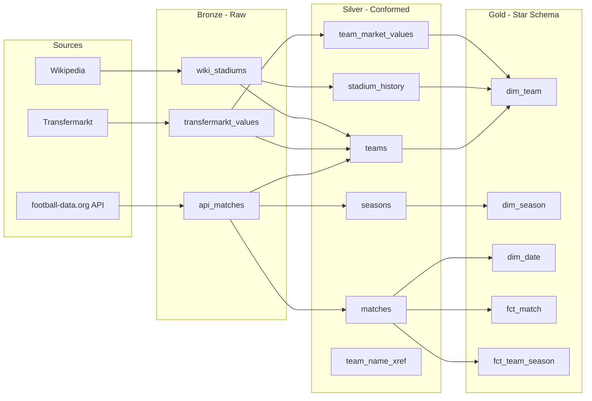
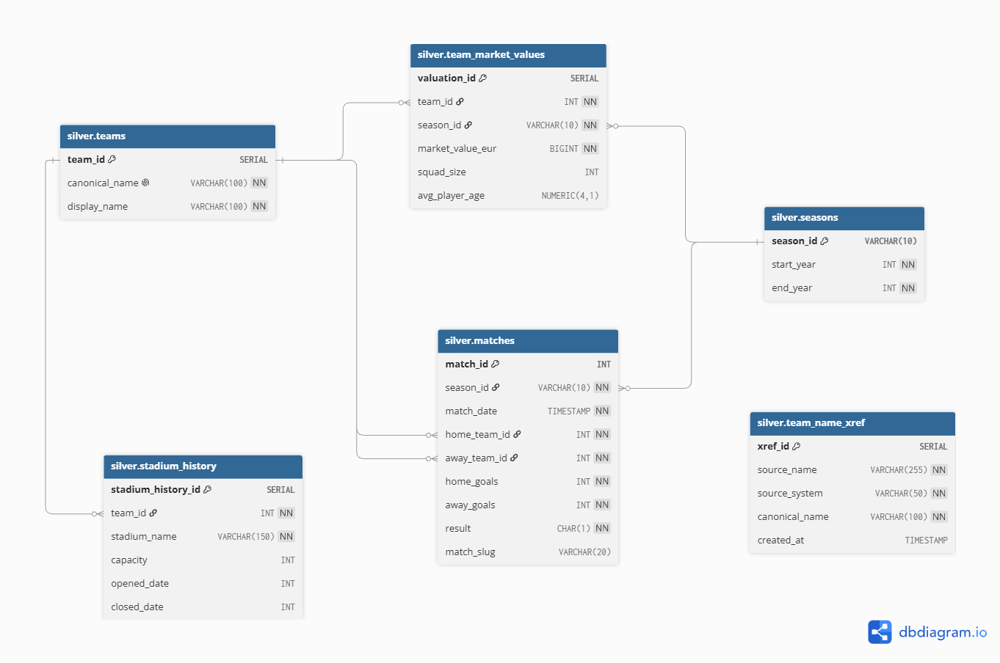
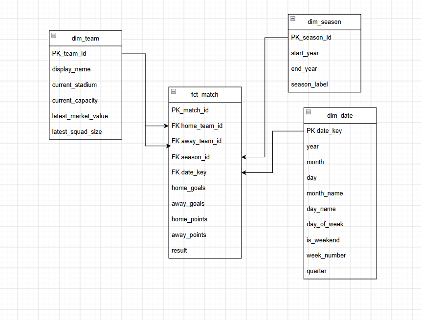
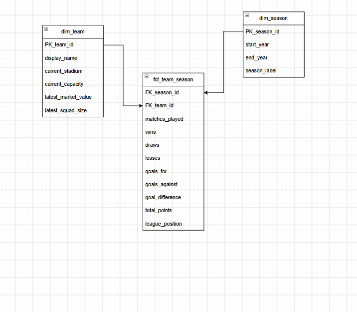

# Football Data Warehouse

A data warehousing solution for English Premier League data built on the **Medallion Architecture** (Bronze, Silver, Gold). The pipeline extracts data from three external sources, transforms it through normalized layers and produces a star schema ready for Power BI dashboards.

---

## Data Architecture



1. **Bronze Layer**: Append-only landing zone. Raw data stored as-is from source systems with `run_id` (UUID) for lineage tracking. No deduplication, no transformation.
2. **Silver Layer**: Deduplicated, normalized and linked entities. Includes team name normalization across all three sources, cross-reference auditing and stadium history tracking.
3. **Gold Layer**: Business-ready star schema for Power BI dashboards (dimensions + facts).

### Silver Layer - ER Diagram


---

## Data Sources

| Source | Data | Method |
|--------|------|--------|
| [football-data.org](https://www.football-data.org/) | Match results, scores, dates | REST API (JSON) |
| [Transfermarkt](https://www.transfermarkt.com/) | Squad market values, size, avg age | Web scraping |
| [Wikipedia](https://en.wikipedia.org/wiki/List_of_Premier_League_stadiums) | Stadium names, capacity, opened/closed years | Web scraping |

---

## Gold Layer

### Star Schema

| Table | Type | Description |
|-------|------|-------------|
| `dim_team` | Dimension | Team name, current stadium and capacity |
| `dim_season` | Dimension | Season years with display label ("2023/24") |
| `dim_date` | Dimension | Calendar table for time intelligence |
| `fct_match` | Fact | One row per match: teams, goals, result |
| `fct_team_season` | Fact | One row per team per season: W/D/L, goals, points, league position |

## 1. Star schema: Match analysis

## 2. Star schema: Season analysis


---

## Data Quality

Automated quality checks run after each pipeline stage. If any check fails, the pipeline stops and bad data doesn't propagate downstream.

| Layer | Checks |
|-------|--------|
| **Bronze** | Tables not empty, no NULL payloads, no invalid entries |
| **Silver** | No duplicate matches, referential integrity, 380 matches per season, no team with multiple active stadiums, market values positive, all names matched via xref |
| **Gold** | 20 teams per season, 38 matches per team, no duplicates in facts/dimensions, league positions 1–20 |

---

## Quick Start

### Prerequisites
- [Docker Desktop](https://www.docker.com/products/docker-desktop/) installed and running
- API key from [football-data.org](https://www.football-data.org/)

### Setup

```bash
# 1. Clone the repository
git clone https://github.com/YOUR_USERNAME/football-dw.git
cd football-dw

# 2. Create .env from template
cp .env.example .env
# Fill in: DB_USER, DB_PASS, FOOTBALL_API_KEY

# 3. Run the entire pipeline
docker-compose up --build
```

### Connect to the Database
```
Host:     localhost
Port:     5433
Database: football_dw
User:     (from .env)
Password: (from .env)
```

Use [pgAdmin](https://www.pgadmin.org/) or [DBeaver](https://dbeaver.io/) to explore the data.

---

## Tools & Technologies

| Technology | Purpose |
|-----------|---------|
| **PostgreSQL 16** | Data warehouse database |
| **Python 3.12** | ETL pipeline |
| **Docker** | Containerization |
| **BeautifulSoup** | Web scraping (Transfermarkt, Wikipedia) |
| **Requests** | API calls (football-data.org) |

---

## Repository Structure

```
football-dw/
│
├── docs/                                         # ER diagrams
│   ├── silver_model.png
│   ├── gold_fct_match.png
│   └── gold_fct_team_season.png
│
├── sql/                                          # Schema definitions
│   ├── 01_init_schemas.sql                       # raw/silver/gold schemas
│   ├── 02_raw_tables.sql                         # Bronze layer tables
│   ├── 03_silver_tables.sql                      # Silver layer tables + normalize function
│   ├── 04_gold.sql                               # Gold layer: star schema
│   └── deletion.sql                              # Teardown script
│
├── src/
│   ├── db.py                                     # Database connection manager
│   ├── extract/
│   │   ├── football_api.py                       # REST API extractor
│   │   ├── transfermarkt.py                      # Transfermarkt scraper
│   │   └── wiki_scraper.py                       # Wikipedia scraper
│   ├── transform/
│   │   ├── to_silver.py                          # Bronze → Silver transformation
│   │   └── to_gold.py                            # Gold materialized view refresh
│   └── quality/
│       └── checks.py                             # Automated quality checks
│
├── docker-compose.yml                            # Multi-container setup
├── Dockerfile                                    # Pipeline container
├── entrypoint.sh                                 # Container startup script
├── main.py                                       # Pipeline orchestrator
├── requirements.txt                              # Python dependencies
├── .env.example                                  # Environment variable template
└── .gitignore
```

---

## Design Decisions

| Decision | Reasoning |
|----------|-----------|
| PostgreSQL over Snowflake/BigQuery | Free, runs locally in Docker |
| Materialized views for Gold | Pre-computed for fast reads, refreshed after each pipeline run |
| Append-only Bronze | Full audit trail - every raw record preserved with `run_id` |
| Upsert in Silver | Pipeline is idempotent - can run repeatedly without duplicates |
| Kimball star schema | Optimized for Power BI - no complex joins needed in dashboards |
| Custom normalize function | Three sources with inconsistent naming need automated matching |

---

## Known Limitations

- **Stadium dates**: Wikipedia provides only year-level granularity
- **Market value parsing**: Transfermarkt values ("€1.20bn") parsed via regex - unexpected formats could fail
- **Single league**: Premier League only - extending requires parameterizing competition ID

---

## Future Work

- Power BI dashboard connected to Gold star schema
- Building ML model and ML views
- More seasons for better ML model accuracy
- Azure deployment (PostgreSQL Flexible Server + Container Instances)
- CI/CD pipeline (GitHub Actions)
- Orchestration with Airflow/Prefect